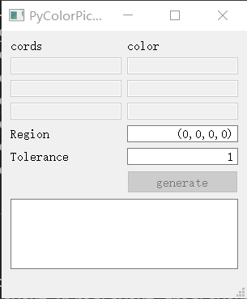

# 如何使用colorPicker
colorPicker这个工具的作用是方便地生成`colors.util.ColorToMatch`所需要的参数。

## 安装依赖
首先安装`requirments.txt`列出的包（是的这个文件名是个typo你知道就好）：
```
pip install -r requirments.txt
```

其中`keyboard`模块在使用中可能会碰到[这个问题](https://github.com/boppreh/keyboard/issues/186)，[这个链接](https://github.com/boppreh/keyboard/issues/186#issuecomment-460635871)是这个问题的workaround。

## 运行和交互
运行的时候需要确保当前的工作目录中有main.ui：
```cmd
cd img
python main.py
```

下图是colorPicker的主界面：



colorPicker通过六个键盘快捷键`1`, `2`, `3`, `c`, `s`, `a`和用户界面上的`generate`按钮与用户交互。

在继续之前，我们大致需要了解`colors.util.ColorToMatch`需要三个初始化参数：`region`, `color_list`, `tolerance`。

正如repo的README.md所言，`colors.util.ColorToMatch`的调用形式类似于这个样子：

```python
LiaoAttack = ColorToMatch(
    region=[537, 169, 1459, 963],
    color_list=[[(0, 0), (243, 178, 94)], [(33, -37), (150, 59, 46)], [(-331, -3), (243, 178, 94)]],
    tolerance=1)
```

`region`参数指定了要找颜色的坐标范围。使用鼠标指针和快捷键`s`确定`region`的左上角坐标，使用鼠标指针和快捷键`a`确定右下角坐标；

`color_list`参数是含有三个list的list。`color_list[0]`是“原点颜色”，`color_list[1]`和`color_list[2]`是两个“参考颜色”。参考颜色之坐标是相对于原点颜色之坐标的偏移量(offset)。换句话说，原点颜色的RGB值应该是`region`所圈定的图像区域中最为独特的。原点颜色通过鼠标指针快捷键`1`选定，两个参考颜色由鼠标指针和快捷键`2`、`3`选定；

`tolerance`参数指的是进行找色判决时，对此颜色可容许多大的偏差（见findimg/core.py中`_match_color`）。

于是，**使用colorPicker的流程可归纳为：先用`s`, `a`键框选出要找色的范围，然后分别用`1`、`2`、`3`键确定要找的颜色，接着在界面上确认`tolerance`的取值，最后按快捷键`c`或点击`generate`按钮，则文本框中将会显示结果。这个结果可作为colors.util.ColorToMatch的参数传入。**